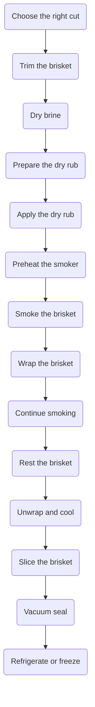

```mermaid
flowchart TD
    id1(Choose the right cut) --> id2(Trim the brisket)
    id2 --> id3(Dry brine)
    id3 --> id4(Prepare the dry rub)
    id4 --> id5(Apply the dry rub)
    id5 --> id6(Preheat the smoker)
    id6 --> id7(Smoke the brisket)
    id7 --> id8(Wrap the brisket)
    id8 --> id9(Continue smoking)
    id9 --> id10(Rest the brisket)
    id10 --> id11(Unwrap and cool)
    id11 --> id12(Slice the brisket)
    id12 --> id13(Vacuum seal)
    id13 --> id14(Refrigerate or freeze)
```
